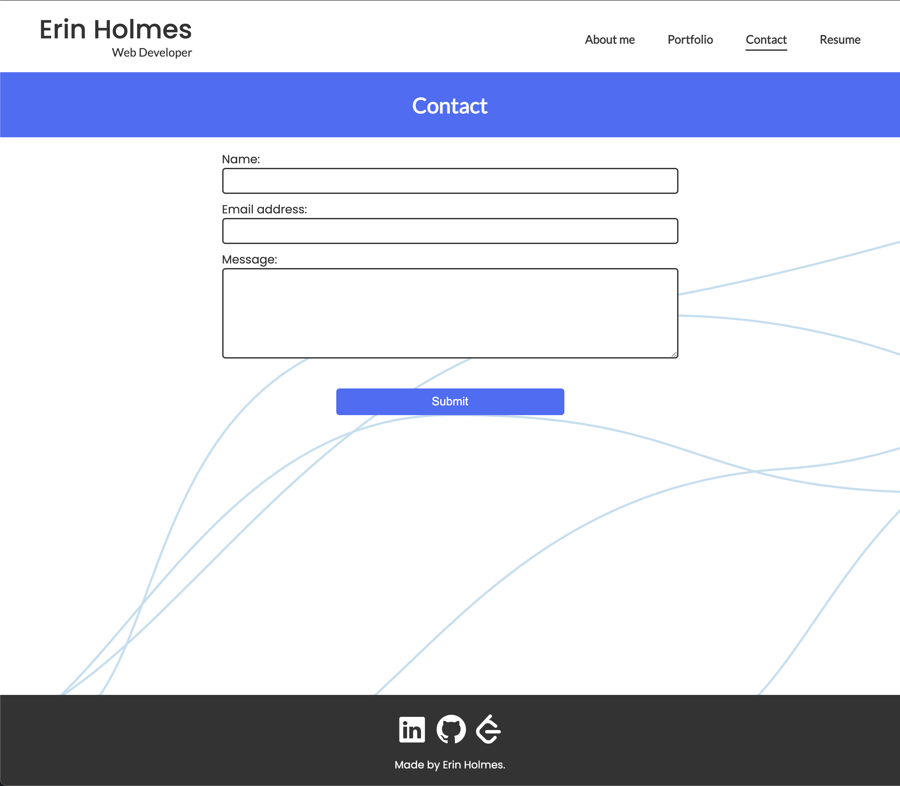

# React Portfolio
## React Challenge

## Description
This week we were challenged to create a professional portfolio using the javascript library, React. This portfolio is a single-page application that uses React's state hook to render content based on the navigation link selected, giving the appearance of multiple pages. All React components in this app are created using JSX, an XML/HTML-like syntax. JSX allows javascript expressions to be added along side the HTML-like elements within components. In addition to showcasing my front/back-end projects in the portfolio view, this app demonstrates my knowledge of React, an incresingly useful skill to have as a full-stack developer. 

## Deployed Application: 
https://emholmes.github.io/react-portfolio/ 

## Screenshots

About me view: 

Portfolio view:

Contact view:

Resume view: 

## Questions
If you have any questions or feedback, create a new issue and add the label "question". 
View more of my work: [github.com/emholmes](https://github.com/emholmes).
